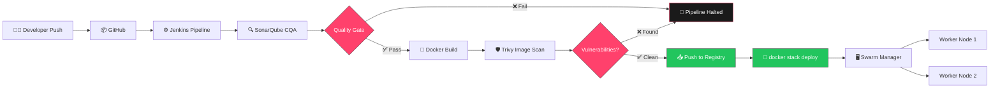

<div align="center">


<br/>

<a href="#-architecture">Architecture</a> •
<a href="#-pipeline-flow">Pipeline</a> •
<a href="#-security-gates">Security</a> •
<a href="#-infrastructure">Infra</a> •
<a href="#-quick-start">Quick Start</a> •
<a href="#-contact">Contact</a>

<br/>


</div>

<br/>

## 📖 Overview

**Project Zomato** is a Dockerized reference deployment of a Zomato-style food discovery application, shipped end-to-end through a fully automated **DevSecOps pipeline**. Every commit is built, statically analyzed, scanned for vulnerabilities, and deployed across a **multi-node Docker Swarm cluster on AWS EC2** — and the pipeline physically cannot push an image to the registry if the code doesn't pass quality and security gates first.

This isn't a "Docker run and pray" deployment. It's gated, observable, and repeatable.

> 💡 **The core idea:** security and quality checks aren't a report you read after the fact — they're a wall the pipeline can't get through if the code fails.

<br/>

## 🏗️ Architecture



<br/>

## ⚙️ Pipeline Flow

A **10-stage Jenkins Declarative Pipeline** takes every commit from raw code to a live, multi-node deployment — averaging **under 6 minutes** end to end.

| # | Stage | What Happens |
|---|-------|---------------|
| 1 | **Tool Install** | Provisions required CLI tools for the build agent |
| 2 | **Clean Workspace** | Wipes the workspace for a reproducible build |
| 3 | **Code** | Pulls the latest commit from GitHub |
| 4 | **CQA** | Static code analysis via SonarQube |
| 5 | **Quality Gates** | 🚦 Hard stop — pipeline halts if SonarQube flags don't clear |
| 6 | **Build** | Application build |
| 7 | **Image** | Docker image build |
| 8 | **Image Scan** | 🛡️ Trivy scans the image for CVEs before it goes anywhere |
| 9 | **Push** | Clean, scanned image pushed to the registry |
| 10 | **Deploy** | `docker stack deploy` rolls the release out across the Swarm |

<details>
<summary><b>🔍 Click to see the actual Jenkinsfile structure</b></summary>

```groovy
pipeline {
    agent any

    tools {
        jdk 'jdk17'
        nodejs 'node16'
    }

    environment {
        SCANNER_HOME = tool 'sonar-scanner'
    }

    stages {
        stage('Clean Workspace') {
            steps { cleanWs() }
        }

        stage('Code') {
            steps {
                git branch: 'main', url: 'https://github.com/jyothisai0336/Project_Zomato.git'
            }
        }

        stage('CQA - SonarQube Analysis') {
            steps {
                withSonarQubeEnv('sonar-server') {
                    sh '''
                    $SCANNER_HOME/bin/sonar-scanner \
                    -Dsonar.projectName=zomato \
                    -Dsonar.projectKey=zomato
                    '''
                }
            }
        }

        stage('Quality Gates') {
            steps {
                waitForQualityGate abortPipeline: true
            }
        }

        stage('Build Docker Image') {
            steps {
                sh 'docker build -t zomato:${BUILD_NUMBER} .'
            }
        }

        stage('Trivy Image Scan') {
            steps {
                sh 'trivy image zomato:${BUILD_NUMBER} --severity HIGH,CRITICAL --exit-code 1'
            }
        }

        stage('Push to Registry') {
            steps {
                sh 'docker push <registry>/zomato:${BUILD_NUMBER}'
            }
        }

        stage('Deploy to Swarm') {
            steps {
                sh 'docker stack deploy -c docker-compose.yml zomato-stack'
            }
        }
    }
}
```

</details>

<br/>

## 🛡️ Security Gates

<table>
<tr>
<td width="50%" valign="top">

### SonarQube — Quality Gate

```
✅ Status:          PASSED
🐛 New Bugs:         0
🔓 New Vulnerabilities: 0
🔥 New Security Hotspots: 0
💳 Added Tech Debt:  0
```

Static analysis runs on every commit. If quality drops below threshold, **the pipeline does not proceed.**

</td>
<td width="50%" valign="top">

### Trivy — Image Scan

```
✅ Status:           CLEAN
🛡️ Critical CVEs:    0
⚠️  High CVEs:        0
📦 Scanned Before:    Push to registry
```

No image reaches the container registry — let alone production — without clearing this scan.

</td>
</tr>
</table>

> **Shift-left in practice, not just in theory.** The vulnerability scan sits *before* the push stage, not after. A vulnerable image is architecturally incapable of reaching the registry.

<br/>

## 🖥️ Infrastructure

<div align="center">

| Node | Role | Type | Status |
|------|------|------|--------|
| 🔧 Jenkins | CI/CD Orchestrator | `m7i-flex.large` | 🟢 Running |
| 🧠 Master | Swarm Manager | `m7i-flex.large` | 🟢 Running |
| ⚙️ Worker 1 | Swarm Worker Node | `t3.micro` | 🟢 Running |
| ⚙️ Worker 2 | Swarm Worker Node | `t3.micro` | 🟢 Running |

</div>

All four nodes run on **AWS EC2**, orchestrated as a self-managed **Docker Swarm cluster** — one manager, two workers — with Docker Compose stack files defining service placement and Swarm handling distribution across the cluster.

<br/>

## 🧰 Tech Stack

<div align="center">


</div>

<br/>

## 🚀 Quick Start

```bash
# Clone the repository
git clone https://github.com/jyothisai0336/Project_Zomato.git
cd Project_Zomato

# Build the image locally
docker build -t zomato:local .

# Run standalone
docker run -d -p 3000:3000 zomato:local

# OR deploy as a Swarm stack (requires an initialized swarm)
docker stack deploy -c docker-compose.yml zomato-stack
```

<details>
<summary><b>🔧 Prerequisites</b></summary>

- Docker Engine (Swarm mode enabled for cluster deployment)
- Jenkins with SonarQube Scanner + Trivy installed on agents
- A reachable SonarQube server for the CQA stage
- AWS EC2 instances (or any Docker-capable hosts) for the Swarm nodes

</details>

<br/>

## 📌 Known Limitations

- This is a **reference/demo deployment** — infrastructure is provisioned for demonstration and is not kept running permanently.
- No TLS termination is configured on the demo instances; a production deployment would sit behind a load balancer or reverse proxy with HTTPS.

<br/>

## 📬 Contact

<div align="center">

**Jyothisai Mekala**
DevOps / DevSecOps Engineer

[](mailto:mekalajyothisai3@gmail.com)
[](www.linkedin.com/in/jyothisai-mekala-6852a822a)

<br/>


</div>
